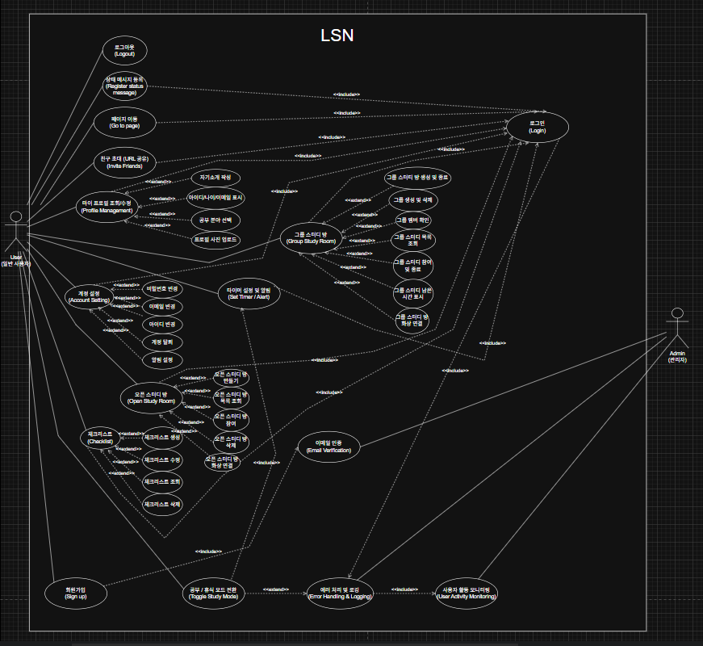

# 2. Use Case Analysis

> This document summarizes the Use Case Diagram and detailed Use Case Descriptions for **Let’s Study Now! (LSN)**.  
> 본 장에서는 LSN 시스템의 Use Case Diagram과 각 Use Case의 상세 설명을 제공한다. 

---

## 2.1 Use Case Diagram

- 액터: **User** (일반 사용자), **Admin** (관리자)  
- 주요 기능: 회원가입(Sign Up), 로그인(Login), 로그아웃(Logout), 프로필 관리(Profile Management), 친구 초대(Friend Invite), 오픈/그룹 스터디룸 입장(Join Open/Group Study Room), 체크리스트 관리(Checklist), 화상 연결(Video), 알림(Notification) 등.  

---

## 2.2 Use Case Descriptions

---

### Use Case #1: Sign Up
- **Summary**  
  사용자가 시스템 이용을 위해 필수 및 선택 정보를 입력하고 계정을 생성한다. 
- **Actor**: User  
- **Preconditions**: 시스템 접속 가능 상태  
- **Trigger**: 메인/로그인 화면에서 ‘회원가입’ 버튼 클릭  
- **Main Success Scenario**
  1. 회원가입 페이지에서 필수 정보를 입력한다.  
  2. 시스템은 ID/이메일 중복 여부를 검증한다.  
  3. 비밀번호 및 선택정보(나이, 프로필 사진, 관심 공부 분야, 자기소개 등)를 입력한다.  
  4. 가입 완료 버튼 클릭 → DB에 저장 → 로그인 페이지로 이동.
- **Extension Scenarios**
  - ID/이메일 중복 또는 이메일 형식 오류 → 오류 메시지 출력 및 재입력 요구.  
  - 프로필 사진 미업로드시 기본 이미지 적용.

---

### Use Case #2: Login
- **Summary**  
  등록된 ID와 비밀번호로 시스템에 로그인한다.
- **Actor**: User  
- **Preconditions**: 회원가입 완료  
- **Trigger**: 로그인 버튼 클릭  
- **Main Success Scenario**
  1. ID/비밀번호 입력 → 인증 수행.  
  2. 인증 성공 시 메인(또는 스케줄) 페이지로 리디렉션. 
- **Extension Scenarios**
  - 입력란 공백 → “ID와 비밀번호를 입력하세요” 메시지.  
  - 정보 불일치 → “ID 또는 비밀번호가 올바르지 않습니다” 메시지. 

---

### Use Case #3: Logout
- **Summary**  
  로그인한 사용자가 시스템에서 로그아웃한다.
- **Actor**: User  
- **Preconditions**: 로그인 상태  
- **Trigger**: 로그아웃 버튼 클릭  
- **Main Success Scenario**
  1. 로그아웃 요청 수신 → 세션 종료 처리 → 메인/로그인 페이지로 이동 및 성공 메시지 표시. 

---

### Use Case #4: Register Status Message
- **Summary**  
  사용자가 현재 기분/상황을 간단한 상태 메시지로 등록하여 다른 참여자와 공유한다. 
- **Actor**: User  
- **Preconditions**: 로그인 상태  
- **Trigger**: 프로필 관리 또는 상태 메시지 메뉴 진입  
- **Main Success Scenario**
  1. 상태 메시지 입력 → 등록 클릭 → 유효성 및 글자수 검사 → DB 저장 → 프로필에 반영.
- **Extension Scenarios**
  - 글자수 초과 → 경고 및 저장 거부.  
  - 저장 취소 또는 페이지 이탈 → 기존 상태 유지.

---

### Use Case #5: Friend Invite (URL)
- **Summary**  
  사용자 고유의 초대 URL을 생성·복사하여 외부로 공유한다. 
- **Actor**: User  
- **Preconditions**: 로그인 상태  
- **Trigger**: 친구 초대 버튼 클릭  
- **Main Success Scenario**
  1. 초대 URL 생성 및 표시 → 복사 → 외부 공유 → 수신자가 접속하면 회원가입/로그인 유도 및 초대정보 인식. 
- **Extension Scenarios**
  - URL 생성 실패(서버 오류) → 에러 표시.  
  - 만료된 URL 접속 시 “유효 기간 만료” 메시지.

---

### Use Case #6: View/Edit My Profile
- **Summary**  
  사용자가 자신의 기본 및 선택 정보를 조회하고 수정한다 (별명, 자기소개, 사진, 공부 분야 등). 
- **Actor**: User  
- **Preconditions**: 로그인 상태  
- **Trigger**: 마이 프로필/프로필 관리 진입  
- **Main Success Scenario**
  1. 현재 프로필 정보 표시 → 수정 → 저장 → DB 반영 및 성공 알림. 
- **Extension Scenarios**
  - 자기소개 글자수 초과 등 → 경고 및 저장 거부.  
  - 프로필 사진 업로드 실패 → 기본 이미지 유지. 

---

### Use Case #7: Write Self-Introduction
- **Summary**  
  자기소개를 작성/수정한다 (최대 200자). 
- **Actor**: User  
- **Preconditions**: 로그인 상태  
- **Trigger**: 프로필 수정 화면에서 자기소개 입력 후 저장  
- **Main Success Scenario**
  1. 자기소개 입력 → 저장 → DB 저장 및 프로필 반영 → 성공 알림.  
- **Extension Scenarios**
  - 200자 초과 시 저장 거부 및 경고 메시지.

---

### Use Case #8: Display Basic Info (ID / Email / Age)
- **Summary**  
  사용자의 ID, 이메일, 나이를 프로필 화면에 표시한다. 
- **Actor**: User  
- **Preconditions**: 로그인 상태  
- **Trigger**: 마이 프로필 페이지 로딩  
- **Main Success Scenario**
  1. DB에서 정보 조회 → 화면에 표시.  
- **Extension Scenarios**
  - 정보 누락 시 “정보 없음” 또는 비공개로 표시. 

---

### Use Case #9: Select/Modify Study Fields
- **Summary**  
  사용자가 관심있는 공부 분야를 1개 이상 선택하거나 수정한다. 
- **Actor**: User  
- **Preconditions**: 로그인 상태  
- **Trigger**: 마이 프로필 수정 > 공부 분야 선택  
- **Main Success Scenario**
  1. 분야 목록 조회 → 선택 → 저장 → DB 반영 → 완료 알림.  
- **Extension Scenarios**
  - 서버 오류로 목록 불러오기 실패 → 이전 목록 유지 또는 재시도 안내.  
  - 선택 개수 제한(최소 1, 최대 5) 위반 시 경고. 

---

### Use Case #10: Upload/Edit Profile Picture
- **Summary**  
  로컬에서 이미지 파일을 선택하여 프로필 사진으로 업로드/변경한다. 
- **Actor**: User  
- **Preconditions**: 로그인 상태  
- **Trigger**: 프로필 사진 업로드 버튼 클릭  
- **Main Success Scenario**
  1. 이미지 파일 선택 → 타입(예: JPEG/PNG/GIF) 검사 → 서버 저장 → 프로필에 반영 및 미리보기 제공.  
- **Extension Scenarios**
  - 지원하지 않는 파일 형식/크기 초과 → 업로드 거부 및 오류 메시지. 

---

### Use Case #11: Account Settings
- **Summary**  
  비밀번호 변경, 이메일 변경, 아이디 변경, 계정 탈퇴 등 계정 관련 설정을 관리한다. 
- **Actor**: User  
- **Preconditions**: 로그인 상태  
- **Trigger**: 계정 설정 메뉴 진입  
- **Main Success Scenario**
  1. 원하는 설정 선택 → 변경 → 저장 → 시스템 반영 및 알림.  
- **Extension Scenarios**
  - 보안 규칙 미준수(새 비밀번호 등) → 에러 및 재입력 요구.  
  - 계정 탈퇴 시 최종 인증(비밀번호 재입력) 및 데이터 삭제/비활성화 처리. 

---

### Use Case #12: Change Password
- **Summary**  
  기존 비밀번호 확인 후 새 비밀번호로 변경한다 (최소 보안 규칙 적용). 
- **Actor**: User  
- **Preconditions**: 로그인 상태  
- **Trigger**: 계정 설정 > 비밀번호 변경 선택  
- **Main Success Scenario**
  1. 현재 비밀번호 확인 → 새 비밀번호 입력(정책 검사) → 암호화 저장 → 성공 알림.  
- **Extension Scenarios**
  - 현재 비밀번호 불일치 → 변경 거부.  
  - 새 비밀번호 보안 규칙 미준수 → 에러 메시지. 

---

### Use Case #13: Change ID
- **Summary**  
  본인 인증 후 새 아이디로 변경(중복 검사 포함). 
- **Actor**: User  
- **Preconditions**: 로그인 상태  
- **Trigger**: 계정 설정 > 아이디 변경  
- **Main Success Scenario**
  1. 새 아이디 입력 → 중복/형식 검사 → 저장 → 재로그인 유도(필요시).  
- **Extension Scenarios**
  - 규칙 위반 또는 중복 시 에러 표시. 

---

### Use Case #14: Delete Account
- **Summary**  
  본인 인증(비밀번호) 후 계정을 탈퇴하고 관련 데이터를 삭제/비활성화한다. 
- **Actor**: User  
- **Preconditions**: 로그인 상태  
- **Trigger**: 계정 설정 > 계정 탈퇴 선택  
- **Main Success Scenario**
  1. 최종 경고 및 본인 확인 → 삭제 처리 → 강제 로그아웃 → 탈퇴 완료 메시지.  
- **Extension Scenarios**
  - 비밀번호 불일치 또는 DB 처리 실패 시 탈퇴 실패 처리. 

---

### Use Case #15: Notification Settings
- **Summary**  
  알림 종류/수신 여부/수단(푸시/이메일) 등을 설정한다. 
- **Actor**: User  
- **Preconditions**: 로그인 상태  
- **Trigger**: 알림 설정 진입  
- **Main Success Scenario**
  1. 토글/옵션 선택 → 저장 → DB 반영 → 알림 변경 확인 메시지.  
- **Extension Scenarios**
  - 필수 알림 해제 시 제한 메시지 표시. 

---

### Use Case #16–20: Open Study Room (Create / View / Join / Delete / List)
- **Summary**  
  오픈 스터디룸 생성, 목록 조회, 참여, 삭제 등 공개 스터디 방 관련 기능 일괄. 
- **Actors**: User  
- **Preconditions**: 로그인 상태  
- **Triggers**: 오픈 스터디 메뉴 진입 / 방 만들기 / 참여 버튼 클릭 등  
- **Key Flows**
  - **Create Room**: 필수 항목(제목, 공부 분야, 최대 인원 등) 입력 → 검증 → 생성 → 자동 입장.  
  - **View List**: 실시간 업데이트되는 카드 형태 목록 제공(필터/검색 포함).  
  - **Join Room**: 정원 확인 → 입장 처리 → 멤버 수 증가.  
  - **Delete Room**: 일정 시간 무참가 또는 방이 빈 상태면 자동 삭제(설정된 타이머에 따라). 
- **Extensions**
  - 정원 초과, 삭제된 방 접근, 실시간 동기화 오류 등 예외 처리. 

---

### Use Case #21: Video Connection (Camera)
- **Summary**  
  스터디룸 내에서 화상(카메라) 연결을 제어한다 (ON/OFF 상태 동기화).
- **Actor**: User  
- **Preconditions**: 방 입장 상태  
- **Trigger**: 카메라 버튼 클릭  
- **Main Success Scenario**
  1. 카메라 ON/OFF 전환 → 상태를 실시간으로 다른 참여자에게 반영 → 영상 송출(ON).  
- **Extension Scenarios**
  - 장치 인식 오류 → 에러 메시지 및 재시도.  
  - 네트워크 지연으로 실시간 반영 불안정 시 재연결 시도. 

---

### Use Case #22–26: Checklist (Create / Edit / View / Delete / Manage)
- **Summary**  
  체크리스트를 생성·수정·조회·삭제하여 개인 목표 관리를 지원한다. 
- **Actors**: User  
- **Preconditions**: 로그인 상태  
- **Triggers**: 체크리스트 메뉴 진입 / 생성/수정/삭제 버튼 클릭  
- **Key Flows**
  - **Create**: 날짜 선택 → 내용 입력(최소 1글자) → 저장 → 달력에 표시(색상 표시).  
  - **Edit**: 기존 항목 선택 → 수정 → 저장.  
  - **View**: 날짜 선택 시 오른쪽에 체크리스트 출력.  
  - **Delete**: 항목 선택 → 삭제 → DB 반영(최종 확인 다이얼로그 포함).
- **Extensions**
  - 내용 미입력 시 경고.  
  - 삭제 시 최종 확인 요구. 

---

### Use Case #27–33: Group Study (Group Rooms, Create, Join, End, Members, Lists)
- **Summary**  
  그룹 기반 스터디룸 생성/참여/관리(그룹 멤버 관리, 시간 지정 자동 종료 등). 
- **Actors**: User (Group Member), Group Admin/Leader  
- **Preconditions**: 로그인 및 그룹 소속  
- **Triggers**: 그룹 스터디 메뉴 진입 / 방 만들기 / 참여 등  
- **Key Flows**
  - 그룹 스터디 방 생성 시 방 정보(그룹 선택, 시간, 인원 등) 입력 → 생성자 자동 입장.  
  - 설정된 공부 시간이 종료되면 자동 종료 및 강제 퇴장.  
  - 그룹 멤버 조회 및 초대(초대 링크) / 멤버 추방(방장 권한) 등. 
- **Extensions**
  - 그룹 삭제는 방장 외 다른 멤버가 없을 경우만 허용.  
  - 다중 그룹 소속 시 필터링 기능 제공. 

---

### Use Case #34: Video Connection
- **Summary**  
  스터디룸 내에서 사용자가 화상 연결(카메라)을 켜고 끌 수 있으며, 모든 참여자에게 해당 상태가 실시간으로 반영된다.
- **Actor**: User  
- **Preconditions**: 스터디룸에 입장한 상태, 카메라 권한 허용  
- **Trigger**: 화상 연결(ON/OFF) 버튼 클릭  
- **Main Success Scenario**
  1. 사용자가 화상 연결 버튼을 누른다(ON).  
  2. 클라이언트가 카메라 장치를 활성화하고 영상 스트림을 서버/피어에 연결한다.  
  3. 시스템은 해당 사용자의 카메라 상태(ON)를 다른 참여자들에게 실시간으로 전파한다.  
  4. 다른 참여자들의 화면에 해당 사용자의 영상이 정상적으로 출력된다.  
- **Extension Scenarios**
  - 카메라 장치 미인식 또는 권한 거부 시 오류 메시지 표시 및 사용자가 재시도하도록 안내.  
  - 네트워크 품질 저하 시 영상 화질 저하 또는 자동으로 비디오 전송을 중단하고 상태 아이콘으로 표시.

---

### Use Case #35: Participant List Check
- **Summary**  
  스터디룸에 현재 입장해 있는 참여자 목록과 각 참여자의 상태(카메라/마이크/타이머 상태 등)를 확인한다.
- **Actor**: User  
- **Preconditions**: 스터디룸에 입장한 상태  
- **Trigger**: 참여자 목록 버튼 클릭 또는 참여자 변동 이벤트 수신  
- **Main Success Scenario**
  1. 사용자가 참여자 목록을 요청한다.  
  2. 서버는 현재 방에 접속한 모든 참여자의 최신 정보를 반환한다(닉네임, 프로필, 상태 등).  
  3. 클라이언트는 목록을 UI에 표시하고, 각 참여자의 상태를 실시간 업데이트한다.  
- **Extension Scenarios**
  - 실시간 동기화 오류 발생 시 “일시적으로 목록을 불러올 수 없습니다” 표시 및 재시도 버튼 제공.  
  - 참여자 개인정보 설정(비공개)으로 일부 정보가 제한되어 있을 경우 해당 항목을 숨김 처리.

---

### Use Case #36: Participation Time Check
- **Summary**  
  사용자가 특정 스터디 세션에서 자신 또는 다른 참여자의 누적 참여 시간 및 현재 세션의 경과 시간을 확인한다.
- **Actor**: User / Admin  
- **Preconditions**: 스터디룸 입장 및 타이머/세션 기록 활성화  
- **Trigger**: 참여 시간 조회 요청 또는 세션 종료 시 자동 계산  
- **Main Success Scenario**
  1. 사용자가 ‘참여 시간 보기’ 요청을 한다.  
  2. 시스템은 DB/캐시에서 해당 사용자의 누적 참여 시간 및 현재 세션 경과 시간을 조회한다.  
  3. 조회 결과를 UI에 표시(분/초 단위, 누적 합계 포함).  
- **Extension Scenarios**
  - 데이터 미수집 또는 동기화 지연 시 “참여 시간 데이터를 불러올 수 없습니다” 알림.  
  - 관리자 권한으로 전체 참여자 통계를 조회할 때 권한 검사 실패 시 접근 차단.

---

### Use Case #37: Timer Setting & Notification
- **Summary**  
  스터디룸에서 타이머(공부/휴식 시간)를 설정하고 타이머 상태 변경 시 알림을 발송한다.
- **Actor**: User (방장 권한 또는 참가자)  
- **Preconditions**: 스터디룸 입장, 타이머 기능 활성화  
- **Trigger**: 타이머 설정/시작/중지/리셋 액션  
- **Main Success Scenario**
  1. 사용자가 타이머 설정(공부 시간/휴식 시간, 반복 여부 등)을 입력하고 시작한다.  
  2. 타이머는 서버 또는 분산 동기화 방식으로 모든 참여자에게 동기화된다.  
  3. 타이머 완료 또는 상태 변경 시 시스템이 실시간 알림(팝업/사운드/상태메시지)을 전송한다.  
- **Extension Scenarios**
  - 네트워크 분리로 인한 비동기 발생 시 재동기화 로직 실행 및 경고 메시지 출력.  
  - 사용자가 알림 수신을 해제한 경우 시각적 표시만 수행하고 푸시/사운드는 생략.

---

### Use Case #38: Study/Break Mode Switch
- **Summary**  
  방장 또는 사용자가 공부 모드와 휴식 모드 간 전환을 수행하여, 방 전체의 상태와 타이머 동작을 변경한다.
- **Actor**: User (방장 우선, 일반 참가자)  
- **Preconditions**: 타이머가 설정되어 있거나 모드 전환 권한 부여  
- **Trigger**: ‘공부 모드’ 또는 ‘휴식 모드’ 전환 버튼 클릭 / 타이머 자동 전환  
- **Main Success Scenario**
  1. 모드 전환 요청 수신(수동 또는 타이머에 의한 자동 전환).  
  2. 서버는 새로운 모드 상태를 저장하고 모든 클라이언트에 전파한다.  
  3. 클라이언트 UI는 모드에 맞게 표시(타이머, 배경, 알림 등)하고 관련 이벤트를 트리거한다.  
- **Extension Scenarios**
  - 권한이 없는 사용자의 강제 전환 시 서버에서 거부 및 경고 표시.  
  - 모드 전환 중 데이터 충돌이 발생하면 최근 상태 우선 정책으로 해결 또는 사용자에게 수동 선택 요청.

---

### Use Case #39: Email Verification
- **Summary**  
  회원가입 또는 이메일 변경 시 사용자의 이메일 주소 유효성을 검증하기 위해 인증 메일을 발송하고 확인 절차를 수행한다.
- **Actor**: User / System (메일 발송 서비스)  
- **Preconditions**: 유효한 이메일 주소 입력, 메일 발송 서비스 정상 동작  
- **Trigger**: 회원가입 완료 또는 이메일 변경 요청 시 인증 메일 발송  
- **Main Success Scenario**
  1. 시스템이 사용자 이메일로 고유 인증 링크(또는 코드)를 발송한다.  
  2. 사용자가 메일의 링크 클릭 또는 인증 코드 입력으로 인증을 수행한다.  
  3. 인증 성공 시 계정 상태를 ‘이메일 인증 완료’로 갱신한다.  
- **Extension Scenarios**
  - 메일 전송 실패(서버/SMTP 오류) 시 재전송 옵션 제공 및 사용자에게 안내.  
  - 인증 링크 만료 시 “인증 링크가 만료되었습니다” 메시지와 재요청 방법 제시.

---

### Use Case #40: Error Handling & Logging
- **Summary**  
  시스템에서 발생하는 오류를 적절히 처리하고, 모든 중요 이벤트와 오류를 로그로 남겨 추후 분석 및 복구에 활용한다.
- **Actor**: System / Admin / User (간접)  
- **Preconditions**: 로깅 시스템(파일/DB/외부 모니터링) 구성  
- **Trigger**: 예외 발생(네트워크 오류, DB 오류, 인증 실패 등)  
- **Main Success Scenario**
  1. 오류 발생 시 애플리케이션은 예외를 포착하고 사용자에게 적절한 오류 메시지를 표시한다(보안상 민감 정보 제외).  
  2. 동일 이벤트를 로깅 시스템에 기록(타임스탬프, 사용자, 에러 코드, 스택트레이스 등).  
  3. 관리자 대시보드에서 로그 조회 및 필터링, 알림 설정이 가능하다.  
- **Extension Scenarios**
  - 로그 저장 실패 시 임시 저장소로 백업 후 재저장 시도.  
  - 치명적 오류 발생 시 자동 알림(관리자 이메일/슬랙 등)을 전송하고, 장애 대응 프로세스를 트리거.

---

## Appendix: Summary Table (간단 요약)

| # | Use Case (Title) | Actor | 핵심 동작 |
|---:|-------------------|-------|-----------|
| 1 | Sign Up | User | 회원가입(정보 입력, 중복검사) |
| 2 | Login | User | 인증 → 리디렉션 |
| 3 | Logout | User | 세션 종료 |
| 4 | Register Status | User | 상태 메시지 등록 |
| 5 | Friend Invite | User | 초대 URL 생성/공유 |
| 6 | My Profile | User | 조회/수정 |
| 7 | Write Intro | User | 자기소개 작성(200자) |
| 8 | Display Basic Info | User | ID/Email/Age 표시 |
| 9 | Study Fields | User | 관심 분야 선택 |
|10 | Profile Picture | User | 사진 업로드 |
|11 | Account Settings | User | 비밀번호/이메일/탈퇴 등 |
|12 | Change Password | User | 비밀번호 교체 |
|13 | Change ID | User | 아이디 변경 |
|14 | Delete Account | User | 계정 탈퇴 |
|15 | Notification Settings | User | 알림 설정 |
|16–20 | Open Room (create/list/join/delete) | User | 공개 스터디 관리 |
|21 | Video Connection | User | 화상 ON/OFF |
|22–26 | Checklist | User | 체크리스트 CRUD |
|27–33 | Group Study | Group Member/Admin | 그룹 스터디 관리 |
| 34 | Video Connection | User | 화상 연결(카메라 ON/OFF) 제어 및 상태 실시간 반영 |
| 35 | Participant List Check | User | 스터디룸 내 참여자 목록 및 상태 정보 확인 |
| 36 | Participation Time Check | User / Admin | 각 사용자별 누적 참여 시간 및 세션 시간 조회 |
| 37 | Timer Setting & Notification | User | 공부/휴식 타이머 설정 및 완료 알림 전송 |
| 38 | Study/Break Mode Switch | User | 공부 모드 ↔ 휴식 모드 전환 및 UI/타이머 연동 |
| 39 | Email Verification | User / System | 회원가입·이메일 변경 시 인증 메일 발송 및 검증 |
| 40 | Error Handling & Logging | System / Admin | 예외 발생 시 처리 및 시스템 로그 기록 관리 |
