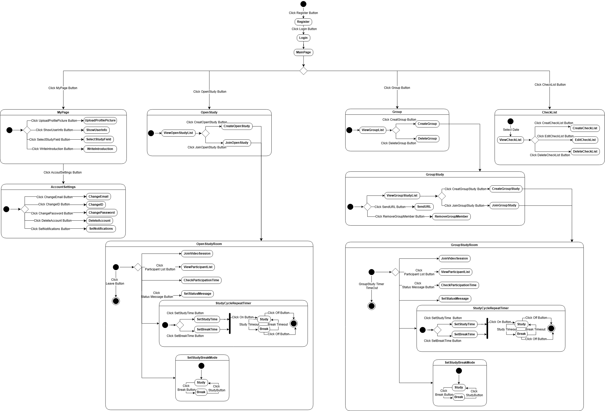

# 5. State Machine Diagram

## 5.1 초기 진입 및 인증 흐름

**초기 상태**  
- 애플리케이션이 처음 시작하면 초기 상태에서 시작한다.  
- 사용자는 회원가입(Register) 또는 로그인(Login)을 선택할 수 있다.

**상태 전이**
- Initial → [Register 버튼 클릭] → Register  
  → 회원가입 화면 표시  
- Initial → [Login 버튼 클릭] → Login  
  → 로그인 화면 표시  
- Login → [로그인 성공] → MainPage  
  → 애플리케이션의 핵심 기능 접근 가능

---

## 5.2 MainPage

**설명**  
MainPage는 애플리케이션의 중심 허브 역할을 한다.  
여기서 사용자는 4개의 주요 기능(MyPage, OpenStudy, Group, CheckList)으로 이동할 수 있다.

**상태 전이**
- MainPage → [MyPage 버튼] → MyPage  
- MainPage → [OpenStudy 버튼] → OpenStudy  
- MainPage → [Group 버튼] → Group  
- MainPage → [CheckList 버튼] → CheckList  
- MainPage → [GroupStudy 버튼] → GroupStudy  

---

### 5.2.1 MyPage

**설명**  
MyPage에서는 개인 프로필과 계정 정보를 관리할 수 있다.  
프로필 사진, 자기소개, 관심분야 설정, 계정 설정 등의 하위 기능이 있다.

**상태 전이**
- MyPage → [UploadProfilePicture 버튼] → UploadProfilePicture  
  → 프로필 사진 업로드  
- MyPage → [ShowUserInfo 버튼] → ShowUserInfo  
  → 사용자 정보 조회  
- MyPage → [SelectStudyField 버튼] → SelectStudyField  
  → 관심 스터디 분야 선택  
- MyPage → [WriteIntroduction 버튼] → WriteIntroduction  
  → 자기소개 작성  
- MyPage → [AccountSettings 버튼] → AccountSettings  
  → 계정 설정 화면 진입

#### AccountSettings 하위 상태
- AccountSettings → [ChangeEmail 버튼] → ChangeEmail  
  → 이메일 변경  
- AccountSettings → [ChangePassword 버튼] → ChangePassword  
  → 비밀번호 변경  
- AccountSettings → [DeleteAccount 버튼] → DeleteAccount  
  → 계정 삭제  
- AccountSettings → [SetNotifications 버튼] → SetNotifications  
  → 알림 설정 조정

---

### 5.2.2 OpenStudy

**설명**  
OpenStudy는 공개 스터디 기능으로, 사용자가 개설된 스터디를 조회하거나 직접 만들고 참여할 수 있다.

**상태 전이**
- OpenStudy → [기본 진입] → ViewOpenStudyList  
  → 개설된 스터디 목록 조회  
- OpenStudy → [CreateOpenStudy 버튼] → CreateOpenStudy  
  → 새로운 오픈 스터디 생성  
- OpenStudy → [JoinOpenStudy 버튼] → JoinOpenStudy → OpenStudyRoom  
  → 선택한 스터디 참여 후 실제 세션 진입

---

### 5.2.3 Group

**설명**  
Group 기능은 사용자가 속한 그룹을 관리하는 기능이다.

**상태 전이**
- Group → [ViewGroupList 기본 상태]  
  → 소속 그룹 목록 조회  
- Group → [CreateGroup 버튼] → CreateGroup  
  → 새 그룹 생성  
- Group → [DeleteGroup 버튼] → DeleteGroup  
  → 기존 그룹 삭제

---

### 5.2.4 CheckList

**설명**  
CheckList 기능은 사용자가 자신의 학습 계획을 날짜별로 관리할 수 있는 기능이다.

**상태 전이**
- CheckList → [날짜 선택] → ViewCheckList  
  → 해당 날짜의 체크리스트 조회  
- CheckList → [CreateCheckList 버튼] → CreateCheckList  
  → 새로운 체크리스트 항목 생성  
- CheckList → [EditCheckList 버튼] → EditCheckList  
  → 항목 수정  
- CheckList → [DeleteCheckList 버튼] → DeleteCheckList  
  → 항목 삭제

---

## 5.3 GroupStudy

**설명**  
GroupStudy는 그룹 멤버와 함께 진행하는 공동 스터디 기능이다.  
스터디 생성, 참여, 초대, 멤버 관리 등의 기능을 포함한다.

**상태 전이**
- MainPage → [GroupStudy 버튼] → GroupStudy  
- GroupStudy → [ViewGroupStudyList 기본 상태]  
  → 그룹 스터디 목록 조회  
- GroupStudy → [SendIRL 버튼] → SendIRL  
  → 그룹 멤버에게 참여 초대 전송  
- GroupStudy → [CreateGroupStudy 버튼] → CreateGroupStudy  
  → 새로운 그룹 스터디 생성  
- GroupStudy → [JoinGroupStudy 버튼] → JoinGroupStudy → GroupStudyRoom  
  → 스터디 참여 후 세션 진입  
- GroupStudy → [RemoveGroupMember 버튼] → RemoveGroupMember  
  → 멤버 제거

---

## 5.4 Study Room

### 5.4.1 OpenStudyRoom

**설명**  
OpenStudyRoom은 실제 스터디 세션이 진행되는 공간이다.  
화상 연결, 참여 시간 확인, 타이머(StudyCycleRepeatTimer) 기능이 포함된다.

**상태 전이**
- OpenStudyRoom → [JoinVideoSession]  
  → 화상 세션 참여  
- OpenStudyRoom → [CheckParticipationTime]  
  → 자신의 참여 시간 확인  
- OpenStudyRoom → [ParticipantList 버튼] → ViewParticipantList  
  → 현재 참여자 목록 조회  
- OpenStudyRoom → [StatusMessage 버튼] → SetStatusMessage  
  → 상태 메시지 설정  

#### StudyCycleRepeatTimer
- OpenStudyRoom → [SetStudyTime 버튼] → SetStudyTime  
- OpenStudyRoom → [SetBreakTime 버튼] → SetBreakTime  
- OpenStudyRoom → [On 버튼] → Study  
- Study → [Study Timeout] → Break  
- Break → [Break Timeout] → Study  
- OpenStudyRoom → [Off 버튼] → 종료  
- OpenStudyRoom → [Break 버튼] → Break  
- OpenStudyRoom → [Study 버튼] → Study  
- OpenStudyRoom → [Leave 버튼] → 종료  

---

### 5.4.2 GroupStudyRoom

**설명**  
GroupStudyRoom은 그룹 스터디 세션이 진행되는 공간이다.  
OpenStudyRoom과 동일한 기능 구조를 가지며, 그룹 멤버 중심으로 작동한다.

**상태 전이**
- GroupStudyRoom → [JoinVideoSession]  
- GroupStudyRoom → [ViewParticipantList]  
- GroupStudyRoom → [CheckParticipationTime]  
- GroupStudyRoom → [SetStatusMessage]  
- GroupStudyRoom → [SetStudyTime] → Study  
- Study → [Study Timeout] → Break  
- Break → [Break Timeout] → Study  
- GroupStudyRoom → [Timer Timeout] → 종료  

