# 6. User Interface Prototype

이 문서는 **Let’s Study Now** 프로젝트의 각 페이지별 사용자 인터페이스(UI) 프로토타입을 설명한다.  
디자인과 문장은 개발에 따라 일부 변경될 수 있으나, 전반적인 구성은 동일하다.

---

## 🏠 메인 페이지

프로젝트에 대한 간략한 설명과 함께 **navigation bar**를 통해 다른 페이지로 이동할 수 있다.  
“지금 시작하기” 버튼을 누르면 회원가입 페이지로 이동한다.  
각 아이콘 클릭 시 해당 기능 페이지로 이동할 수 있다.

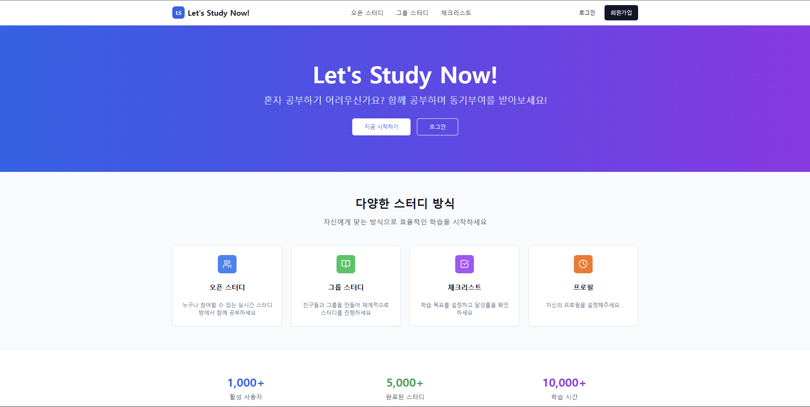

---

## 🔐 로그인 페이지

아이디와 비밀번호를 입력하면 로그인 후 메인 페이지로 이동한다.  
계정이 없는 사용자는 **회원가입 페이지로 이동**할 수 있다.

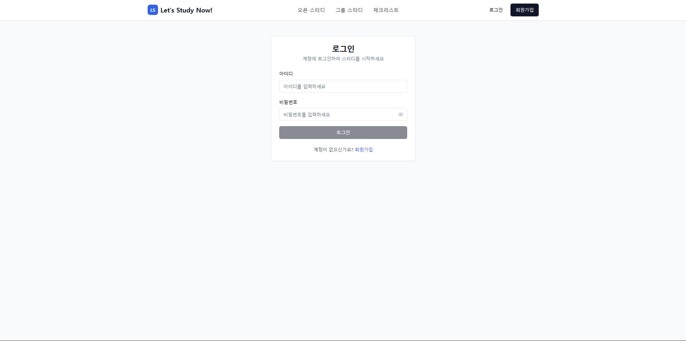

---

## 🧾 회원가입 페이지

사용자는 다음 정보를 입력하여 회원가입할 수 있다:

- 아이디  
- 나이 *(선택사항)*  
- 이메일  
- 비밀번호 / 비밀번호 확인  
- 관심 공부 분야 *(1~5개 선택 필수)*  
- 자기소개 *(선택사항)*  

이미 계정이 있는 경우 로그인 페이지로 이동할 수 있다.

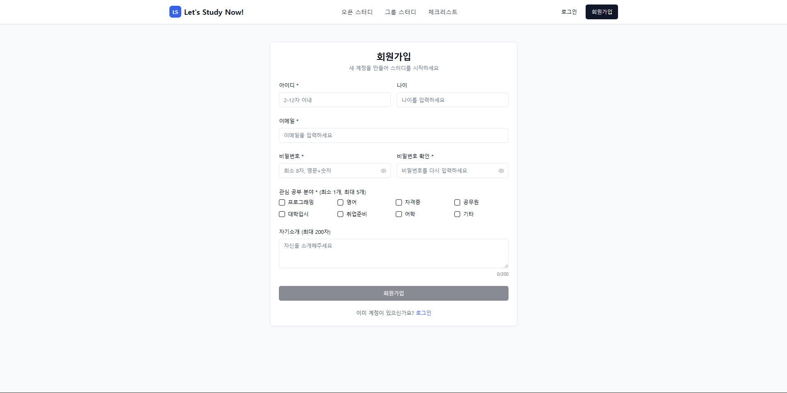

---

## 📚 오픈 스터디 룸 페이지

활성화된 방, 참여 가능한 방, 총 참여자 수를 표시한다.  
새로 생긴 방을 최신화하기 위한 **새로고침 버튼**과 **방 만들기 버튼**이 있다.  
각 방에 들어갔을 때의 세부 페이지도 추가될 예정이다.

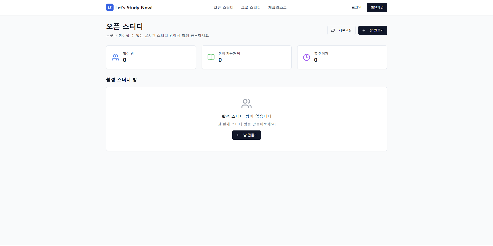

---

## ➕ 방 만들기 페이지

“방 만들기” 버튼 클릭 시 아래 항목들을 설정할 수 있다.

- 제목  
- 설명 *(선택사항)*  
- 최대 인원 수  
- 공부 분야  

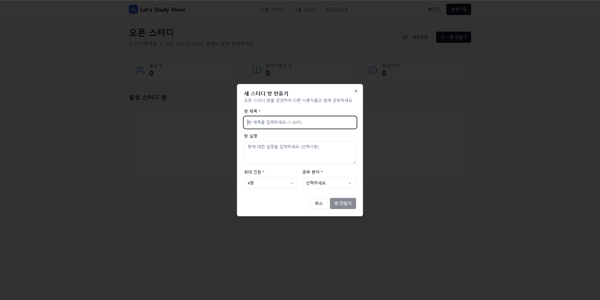

---

## 👥 그룹 스터디 방 페이지

그룹을 생성하여 그룹 스터디 방을 만들 수 있다.  
그룹 이름은 필수, 그룹 설명은 선택사항이다.  
추후 공부 시간 및 공부 분야 설정 기능이 추가될 예정이다.

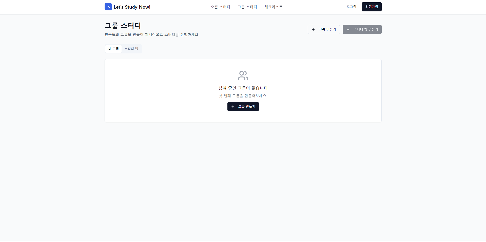

---

## 🗓️ 체크리스트 페이지

사용자가 학습 목표를 설정하고 달성률을 확인할 수 있는 페이지이다.

- 왼쪽: 날짜 선택 (빨간색은 체크리스트 존재일)  
- 오른쪽: 선택한 날짜의 체크리스트 생성 가능  

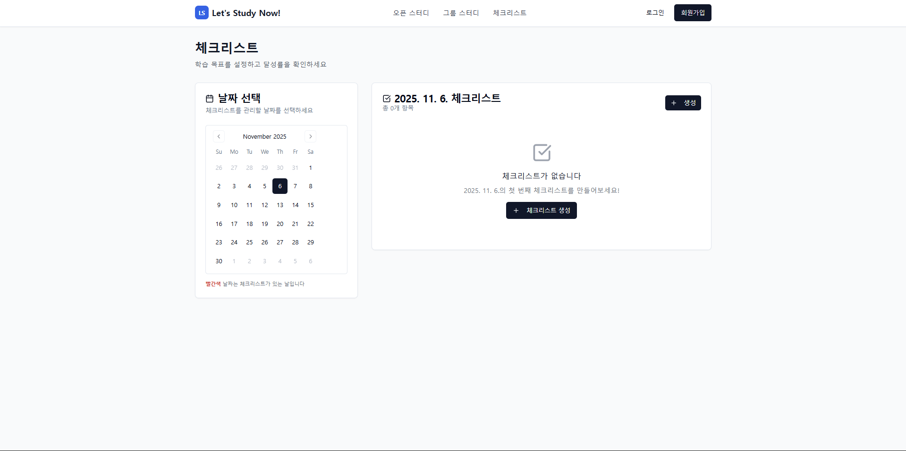

체크리스트 내용을 입력하여 새로운 항목을 추가할 수 있다.

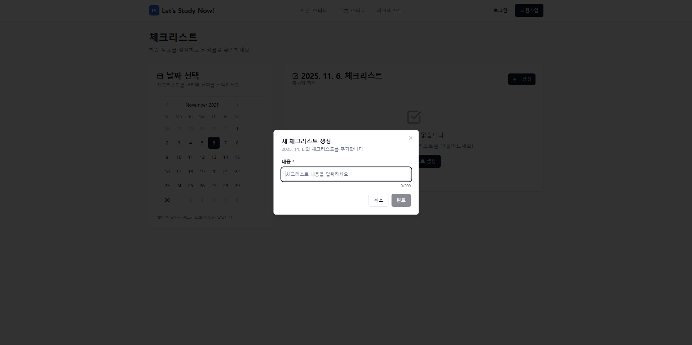

---

## 🙍 마이페이지

### 📌 프로필 탭
- 프로필 사진, 아이디, 나이, 이메일 (읽기 전용)
- 관심 공부 분야 (최소 1개, 최대 5개)
- 자기소개 수정 및 저장 가능

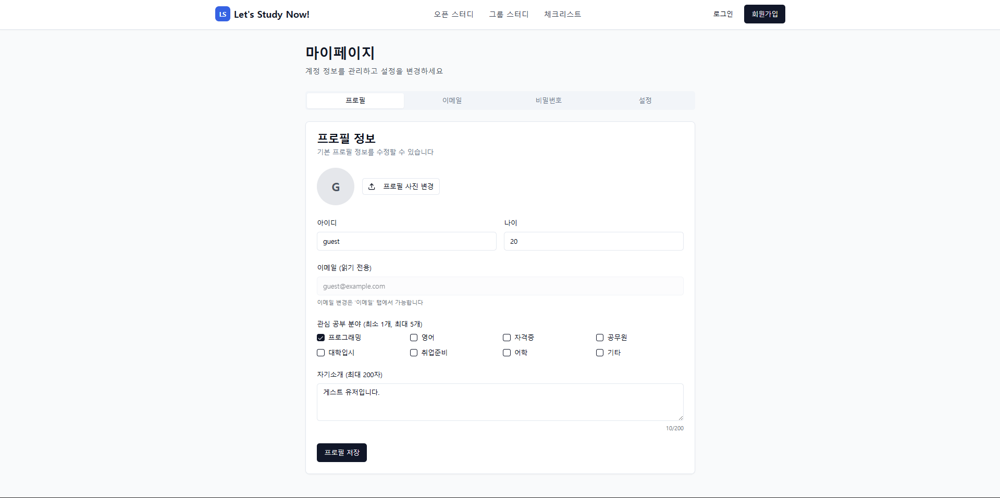

---

### ✉️ 이메일 탭
- 현재 이메일을 새 이메일로 변경 가능

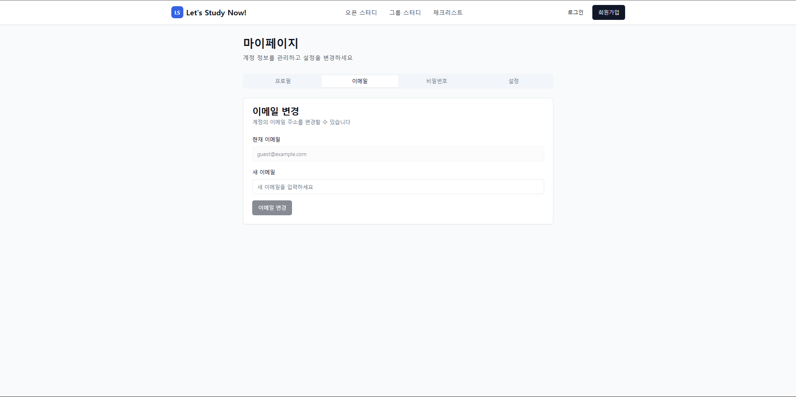

---

### 🔑 비밀번호 탭
- 현재 비밀번호, 새 비밀번호, 새 비밀번호 확인 입력으로 변경 가능

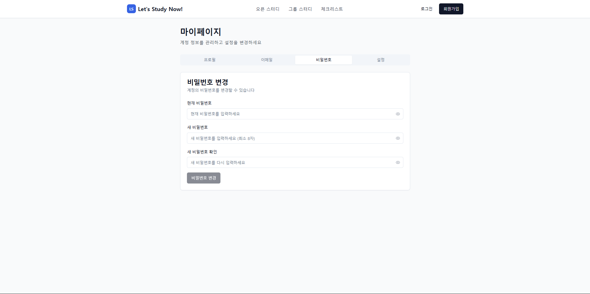

---

### ⚙️ 설정 탭
- 알림 수신 여부 설정 가능  
- 계정 탈퇴 기능 포함 (탈퇴 시 경고 메시지 표시)

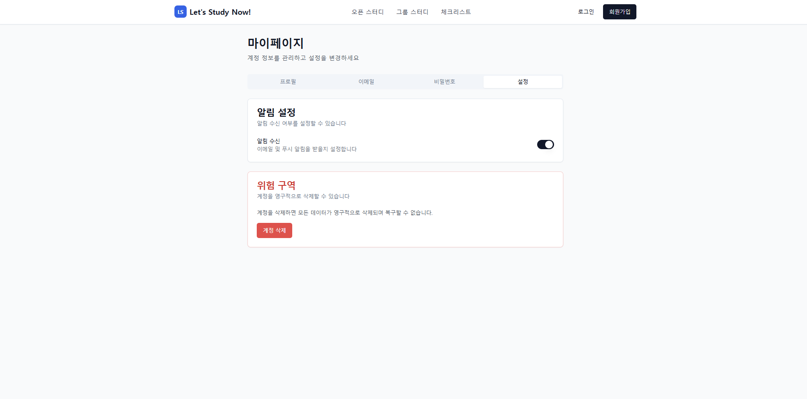

---

> **Note:**  
> 본 UI 프로토타입은 설계 단계의 예시로, 실제 구현 시 디자인과 구성은 변경될 수 있다.
